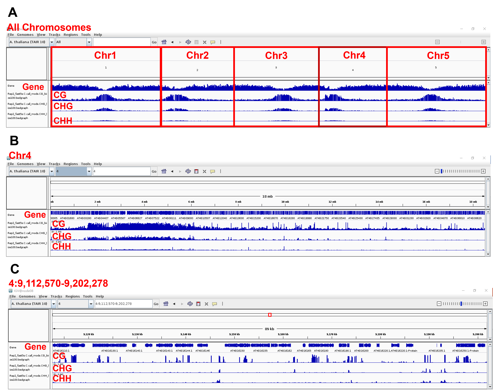

# Overview


# Equipment 

Linux version 3.10.0-862.el7.x86_64 (Red Hat 4.8.5-28) with 48 CPU (2*Intel Gold 6140, 18 cores, 2.3 Ghz) and GPU (2*Nvidia V100, 640 cores, 32 GB).

# Installation
The following software shoud be installed according to the guidance in the related protocol.
1.	[Guppy 4.0.0+](https://timkahlke.github.io/LongRead_tutorials/BS_G.html)
2.	[DeepSignal-plant v0.1.5](https://github.com/PengNi/DeepSignal-plant)
* The pipeline of DeepSignal-plant depends on the softwares listed as follow:  
  a.	[ont_fast5_api v4.0.2](https://github.com/nanoporetech/ont_fast5_api)  
  b.	[tombo v1.5.1](https://github.com/nanoporetech/tombo)  
  c.	[Conda v4.9.2](https://docs.conda.io/en/latest/)  
h5ls tools we use to preview the FAST5 files would be installed automatically with conda.
4.  [The Integrative Genomics Viewer (IGV) v2.6.1](https://software.broadinstitute.org/software/igv/)
5.  [Python 3.7.12](https://www.python.org/)
	* [Numpy v1.20.3](https://numpy.org/)
	* [Pandas v1.3.4](https://pandas.pydata.org/)
	* [Click v8.1.3](https://click.palletsprojects.com/en/8.1.x/)
	* [Seaborn v0.11.1](https://seaborn.pydata.org/)
	* [Matplotlib v3.4.1](https://matplotlib.org/)
	* [hurry.filesize 0.9](https://pypi.org/project/hurry.filesize/)

# Related scripts
The pipeline we used in this protocol can be downloaded on the GitHub page: (https://github.com/Bio-protocol/DeepSignalplantPractise) with the command: 
```
git clone https://github.com/Bio-protocol/DeepSignalplantPractise 
```
The users can find the step-by-step commands in the folder “workflow” which are also listed in the boxes in this protocol. The examples for intermediate and the final output were stored in “cache” and “output” folders, respectively. The “lib” folder contains python scripts used within the workflow. The users can prepare the input data in the “input” folder as the following guidance.

# Input Data  

**a. Nanopore data**  
The Nanopore sequence sample data "sample_data.tar.gz" we used here was modified from the sample data provided by Deepsignal-plant13. The user can download it from ["Step1_Input" folder in Google Drive](https://drive.google.com/drive/folders/1NZe6mQ5y1S8eaE-GwU124PvmONBoz5X7?usp=sharing) to a local computer and transfer it to the folder "DeepSignalplantPractise/input/Step1_Input". The command below is used to decompress the file:

```
tar -zxvf sample_data.tar.gz 
```

**b. Reference genome and annotation**  
```
#download reference genome
cd ./DeepSignalplantPractise/input/reference
wget -c http://ftp.ensemblgenomes.org/pub/plants/release-53/fasta/arabidopsis_thaliana/dna/Arabidopsis_thaliana.TAIR10.dna.toplevel.fa.gz 
gunzip Arabidopsis_thaliana.TAIR10.dna.toplevel.fa.gz

#download annotation
wget -c http://ftp.ensemblgenomes.org/pub/plants/release-53/gff3/arabidopsis_thaliana/Arabidopsis_thaliana.TAIR10.53.gff3.gz 
gunzip Arabidopsis_thaliana.TAIR10.53.gff3.gz
#extract the chromosomes coordinates
awk -F "\t" '{if($3=="chromosome") print($1"\t"$4-1"\t"$5)}' Arabidopsis_thaliana.TAIR10.53.gff3 > Tair10_genome.bed
```

**c. Pretrained model**  
The users can download [the model provided by DeepSignal-plant](https://drive.google.com/file/d/1HnDKPEfCAXgo7vPN-zaD44Kqz1SDw160/view?usp=sharing) and move it to the folder "DeepSignalplantPractise/input/model" for 5mC calling in Step5.

# Major steps  
In this protocol, we use $PATHofDeepSignalPlant to indicate the path for Deepsignal-plant download and $CondaEnv to indicate the path of the Conda environment. Users will need to replace these two variables manually with the path they use. All the commands below are expected to be operated under the "DeepSignalplantPractise/workflow" folder. 

**Step1. Convert the multi-read FAST5 into single-read form**  
```
#01.multi_to_single_fast5.sh
multi_to_single_fast5 -i ../input/Step1_Input/sample_data -s ../cache/SINGLE_sample_data/ -t 30 --recursive
```

**Step2. Basecall FAST5 files with Guppy**  

```
#02.basecall.sh
guppy_basecaller \
-i ../cache/SINGLE_sample_data/ \
-s ../cache/SINGLE_sample_data/fastq \
-c dna_r9.4.1_450bps_hac_prom.cfg \
--recursive \
--disable_pings \
--qscore_filtering \
--device "cuda:all:100%"
```

If the users can not access Guppy, they can download the basecalled fastq we prepared in the ["Step3_Input" folder in Google Drive](https://drive.google.com/drive/folders/1pk4vecjdC48gslbeXGNKforUb0jxRPpz?usp=sharing) for the downstream analysis.

**Step3. Add the basecalled sequence back to FAST5 with Tombo preprocess**
```
#03.tombo_preprocess.sh
#environment setting, replace $CondaEnv/deepsignalpenv with your actual path
export PATH=$CondaEnv/deepsignalpenv/bin:$PATH
# Tombo preprocess
cat ../cache/SINGLE_sample_data/fastq/pass/*fastq > ../cache/SINGLE_sample_data/fastq/pass.fastq
tombo preprocess annotate_raw_with_fastqs \
--fast5-basedir ../cache/SINGLE_sample_data/ \
--fastq-filenames ../cache/SINGLE_sample_data/fastq/pass.fastq \
--sequencing-summary-filenames ../cache/SINGLE_sample_data/fastq/sequencing_summary.txt \
--overwrite \
--processes 30
```
**Step4. Map the raw signal to reference genome with Tombo resquiggle**  

```
#04.tombo_resquiggle.sh
#environment setting, replace $CondaEnv/deepsignalpenv with your actual path
export PATH=$CondaEnv/deepsignalpenv/bin:$PATH
# resquiggler
tombo resquiggle \
../cache/SINGLE_sample_data/ \
../input/reference/Arabidopsis_thaliana.TAIR10.dna.toplevel.fa \
--processes 30 \
--corrected-group RawGenomeCorrected_000 \
--basecall-group Basecall_1D_000 \
--overwrite \
--ignore-read-locks
```

**Step5. Call methylation of reads with DeepSignal-plant call_mods**  
```
#05.deepplant-met-mod.sh
#environment setting, replace $CondaEnv/deepsignalpenv with your actual path
export PATH=$CondaEnv/deepsignalpenv/bin:$PATH
#call 5mC
CUDA_VISIBLE_DEVICES=0,1 deepsignal_plant call_mods \
--input_path ../cache/SINGLE_sample_data \
--model_path ../input/model/model.dp2.CNN.arabnrice2-1_120m_R9.4plus_tem.bn13_sn16.both_bilstm.epoch6.ckpt \
--result_file ../cache/SINGLE_sample_data/fast5s.C.call_mods.tsv \
--corrected_group RawGenomeCorrected_000 \
--reference_path ../input/reference/Arabidopsis_thaliana.TAIR10.dna.toplevel.fa \
--motifs C --nproc 30 --nproc_gpu 2
```

**Step6. Calculate methylation frequency with DeepSignal-plant call_freq**  
```
#06.deepplant-met-freq.sh
#environment setting, replace $CondaEnv/deepsignalpenv with your actual path
export PATH=$CondaEnv/deepsignalpenv/bin:$PATH
#calculate frequency
deepsignal_plant call_freq \
--input_path ../cache/SINGLE_sample_data/fast5s.C.call_mods.tsv \
--result_file ../cache/SINGLE_sample_data/fast5s.C.call_mods.freq.bed \
--sort --bed
```

**Step7. Split the result into CG, CHG, and CHH context**  
```
#07.split_context.sh
#replace $PATHofDeepSignalPlant with your actual path
python $PATHofDeepSignalPlant/scripts/split_freq_file_by_5mC_motif.py \
--freqfile ../cache/SINGLE_sample_data/fast5s.C.call_mods.freq.bed \
--ref ../input/reference/Arabidopsis_thaliana.TAIR10.dna.toplevel.fa
```

**Step8. Calculate the weighted methylation level in the bin**  

Because the sample data is too small for bin calculation and visualization, we provide the preprocessed data from Pore-C as the input. Download it from the ["Step8_Input" folder in Google Drive](https://drive.google.com/drive/folders/14xw6gvQz_gjUi6p86NrSHZq59YABlzZO?usp=sharing) and move it to the "DeepSignalplantPractise/input/Step8_Input".  

```
#08.met_level_bin.sh
python ../lib/python_scripts/met_level_bin.py \
--region_bed ../input/reference/Tair10_genome.bed \
--met_bed ../input/Step8_Input/Rep2_fast5s.C.call_mods.CG.frequency.bed \
--prefix Rep2_fast5s.C.call_mods.CG \
--binsize 100000 \
--outdir ../output
```

**Step9. Visualize the methylation level by IGV and python plotting**  

```
#09.chrom_met_visulization.sh
python ../lib/python_scripts/chrom_met_visulization.py \
--cg_bedg ../output/Rep2_fast5s.C.call_mods.CG_binsize100000.bedgraph \
--chg_bedg ../output/Rep2_fast5s.C.call_mods.CHG_binsize100000.bedgraph \
--chh_bedg ../output/Rep2_fast5s.C.call_mods.CHH_binsize100000.bedgraph \
--region_bed ../input/reference/Tair10_genome.bed \
--chrom 4 --outdir ../output
```

# Expected results  
The intermediate results and the final results of this workflow is large, so we **keep only part of the files as examples** under the folder "cache" and "output" respectively, with the name marked with **"EXAMPLE".** The results can be visualized as follow:

* IGV 


* Python plot

